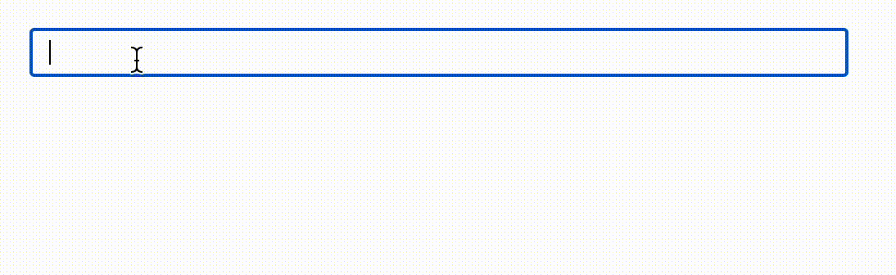
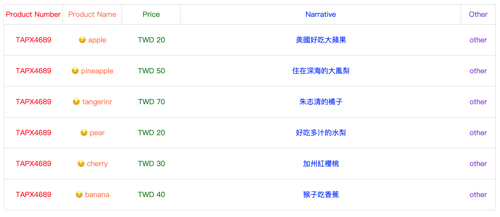

<h1 align="center">Mike Vue UI</h1>

<p align="center">
 mike ui for vue conf workshop.
</p>

<p align="center">
  <a target="_blank" href="https://www.npmjs.com/package/jje-ui">
    
  </a>
  <a target="_blank" href="https://vuejs.org/" title="vue">
      
  </a>
  <a target="_blank" href="http://nodejs.org/download/" title="Node version">
      
  </a>
  <a target="_blank" href="https://github.com/MikeCheng1208/vue-metamask/pulls" title="PRs Welcome">
      
  </a>
</p>

<p align="center">
<a target="_blank" href="https://www.npmjs.com/package/jje-ui">
  
</a>
</p>


## 🚀 Features

- 🎪 **Support for Vue 3** 
- 🦾 **Simple and user-friendly UI components**
- 🔋 **Develop the integration of UnoCSS (optional)**
- 🔩 **Compatible with cjs, es, and iife versions**
- 🌎 **Documentation available：** [中文](./zh-tw/README.md) | English


### 📦 Installation
```
npm install jje-ui -S
```


### 🕶 Style
```javascript
import 'jje-ui/dist/index.css';
```

## ⚡ Components

<details>
  <summary>1. Email Input</summary>

  ## email input
  - Specialized input for emails, providing a dropdown selection.

  
  <br/>

```javascript
import { MEmailInput } from "jje-ui";

const message = ref("");

const options = {
  // 非必要
  suffix: ["@gmail.com", "@hotmail.com", "@yahoo.com"],
};
```

```html
<m-email-input v-model="message" :options="options"></m-email-input>
```
</details>

<br/>

<details>
<summary>2. Simple table.</summary>

<br/>

```javascript
const columns = ref([
  { 
    id: 0, label: 'Product Number', field: 'serial', 
    style: { width: '12%', color: 'red' } 
  },
  { 
    id: 1, label: 'Product Name', field: 'product', 
    style: { width: '12%', color: 'coral' } 
  },
  { 
    id: 2, label: 'Price', field: 'sellingPrice', 
    style: { width: '12%', color: 'green' } 
  },
  { 
    id: 3, label: 'Narrative', field: 'discount', 
    style: { width: '57%', color: 'blue' } 
  },
  { 
    id: 5, label: 'Other', field: 'other', 
    style: { width: '7%', color: 'blueviolet' } 
  },
]);

const rows = ref([
  {
    id: 0,
    serial: 'TAPX4689',
    product: 'apple',
    sellingPrice: 'TWD 20',
    discount: '美國好吃大蘋果',
    other: 'other',
  },
  {
    id: 0,
    serial: 'TAPX4689',
    product: 'pineapple',
    sellingPrice: 'TWD 50',
    discount: '住在深海的大鳳梨',
    other: 'other',
  },
  {
    id: 1,
    serial: 'TAPX4689',
    product: 'tangerinr',
    sellingPrice: 'TWD 70',
    discount: '朱志清的橘子',
    other: 'other',
  },
  {
    id: 2,
    serial: 'TAPX4689',
    product: 'pear',
    sellingPrice: 'TWD 20',
    discount: '好吃多汁的水梨',
    other: 'other',
  },
  {
    id: 3,
    serial: 'TAPX4689',
    product: 'cherry',
    sellingPrice: 'TWD 30',
    discount: '加州紅櫻桃',
    other: 'other',
  },
  {
    id: 4,
    serial: 'TAPX4689',
    product: 'banana',
    sellingPrice: 'TWD 40',
    discount: '猴子吃香蕉',
    other: 'other',
  },
]);
```

```html
<m-pure-table :columns="columns" :rows="rows">
  <template #product="{data}">
    <h3>😏 {{ data.rowData }}</h3>
  </template>
</m-pure-table>
```
</details>


## License

[MIT](./LICENSE) License &copy; 2023-PRESENT [MikeCheng1208](https://github.com/MikeCheng1208)
